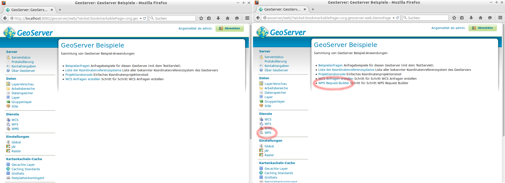

# Installieren von Erweiterungen

Eine Stärke des GeoServers besteht darin, dass seine Funktionalität durch das
Einbinden von zusätzlichen Modulen erweitert werden kann. So gibt es z.B.
Erweiterungen, die es ermöglichen Vektor-Datenquellen zu verwenden, die ihre
Daten aus bestimmten SQL-Datenbanken beziehen (z.B. MySQL oder Oracle). Ebenso
gibt es Erweiterungen, die es ermöglichen *Excel* (und weitere) als Ausgabeformat
zu unterstützen.

Ein vergleichsweise neues Zusatzmodul ist die [Importer-Extension](http://docs.geoserver.org/maintain/en/user/extensions/importer/using.html).
Hiermit ist es auf einfache Weise möglich, Geodaten (Vektor- und Rasterdaten) über die grafische Oberfläche des GeoServers oder eine REST-Schnittstelle zu importieren.
Neben dem Import in das GeoServer-Datenverzeichnis kann auch in Datenbanken (u.a. PostGIS und Oracle) importiert und Vorverarbeitungsschritte (Transformationen o.ä.) vorgeschaltet werden.

## Übersicht über verfügbare Erweiterungen

Auf <http://geoserver.org/release/{{ book.geoServerVersion }}/> finden Sie im Bereich
*Extensions* eine Auflistung zahlreicher Erweiterungen, die als stabil betrachtet
werden und im Rahmen eines Release-Prozesses bereitgestellt werden. Darüberhinaus
gibt es noch *Community-Extensions*, die einen experimentellen oder instabilen
Status haben und kein Teil des offiziellen *Release*-Prozesses sind.

Im Rahmen des Workshops werden wir exemplarisch das WPS-Modul installieren.
[WPS](http://www.opengeospatial.org/standards/wps) steht für *Web Processing Service*
und ist (wie WMS und WFS) ein [Standard des OGC](http://www.opengeospatial.org/standards/wps), in dem Regeln für das Anfragen
und Antworten von (räumlichen) Prozessen, definiert sind.

## Installieren der WPS-Erweiterung

Führen Sie die folgenden Schritte aus, um diese Erweiterung zu installieren:

1. Stoppen Sie den Geoserver durch einen Doppelklick auf **Stop GeoServer** im
   Ordner **Web Services** auf Ihrem Desktop.
1. Laden Sie die WPS-Erweiterung von hier {{ book.workshopRawSourceBaseUrl }}materials/geoserver-{{ book.geoServerVersion }}-wps-plugin.zip
   (oder der offiziellen Release-Seite) herunter. Wählen Sie bitte *Datei speichern*
   und nicht *Öffnen mit*!
1. Wechseln Sie im Terminal in das im vorigen [Abschnitt](./folderstructure.md)
   erläuterte Verzeichnis zur Installation von Erweiterungen:
<pre><xmp style="margin:0; font-size: .85em;">cd {{ book.geoServerPhysicalPath }}webapps/geoserver/WEB-INF/lib/
</xmp></pre>
1. Da Sie root-Rechte benötigen, um in das lib-Verzeichnis schreiben zu können,
   muss der folgende Befehl zum Entpacken des Archivs mit sudo ausgeführt werden:
<pre><xmp style="margin:0; font-size: .85em;">sudo unzip /home/user/Downloads/geoserver-{{ book.geoServerVersion }}-wps-plugin.zip
</xmp></pre>
   Der hier angegebene Pfad bezieht sich auf das Downloads-Verzeichnis, das beim
   Download automatisch angewählt wird. Haben Sie zuvor einen anderen Pfad angegeben,
   muss dieser hier angepasst werden.
1. Wenn die jar-Dateien erfolgreich in das lib-Verzeichnis entpackt wurden, muss
   der GeoServer wieder gestartet werden. Dazu klicken Sie auf **Start GeoServer**
   im Ordner **Web Services** auf dem Desktop.

Sobald der GeoServer hochgefahren ist, können wir in seiner Weboberfläche überprüfen,
ob die Installation der WPS-Erweiterung erfolgreich war. Dazu loggen wir uns
zunächst mit den Zugangsdaten {{ book.geoServerUser }}:{{ book.geoServerPassword }} ein. Anschließend muss in dem Menü
auf der linken Seite (im unteren Bereich) auf Demos geklickt werden. Hier findet
sich nun ein Eintrag *WPS Request-Builder*, den es an dieser Stelle zuvor nicht
gegeben hat.

> **note**
>
> Wenn Sie auf WPS Request-Builder klicken und dort den ersten verfügbaren
> WPS-Prozess *JTS:area* wählen, im Bereich "Process inputs" *TEXT* und
> *application/wkt* wählen, als Dateneingabe POLYGON ((30 10, 40 40, 20 40, 10 20, 30 10))
> verwenden und anschließend auf *Execute process* klicken, müssten Sie das
> Ergebnis *550.0* erhalten.

Im folgenden [Abschnitt](compilesource.md) wird erklärt wie Sie Erweiterungen
(bzw. den GeoServer als solchen) auf Basis des Quellcodes mit maven kompilieren.
