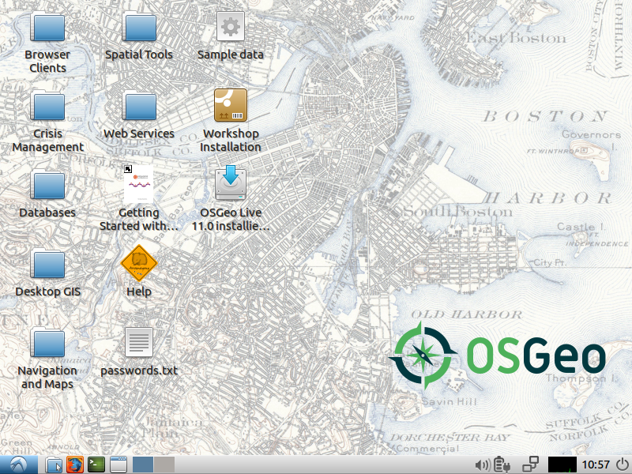
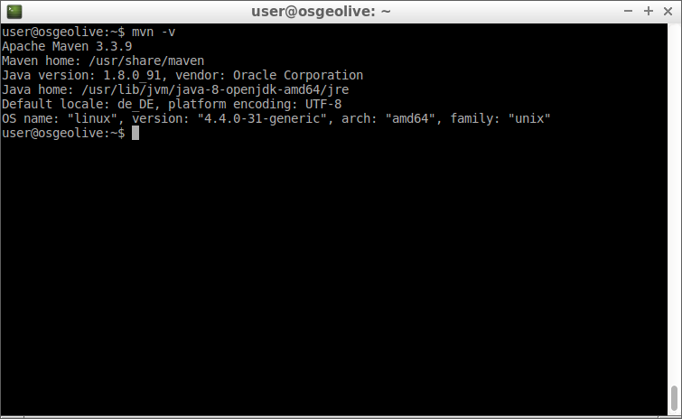

# Vorarbeiten und generelle Informationen

Bevor wir mit dem Workshop starten können, führen Sie bitte die folgenden Schritte
aus:

* Rechner mit OSGeoLive-Medium hochfahren
* Sprache auswählen (Deutsch für korrekte Tastaturbelegung)
* *Lubuntu ohne Installation ausprobieren* auswählen
* Benutzer: user; Passwort: user (wird vermutlich nicht benötigt)



# Setup-Script ausführen

Es gibt ein Skript, welches ihr OSGeoLive-System für diesen Workshop einrichtet.
Das Skript führt die folgenden Aktionen aus:

* Installation des *Build-Management-Tools* Maven
* Deinstallation der INSPIRE-Erweiterung vom GeoServer (wir werden diese Erweiterung
  später mit maven selbst kompilieren und auf dem GeoServer installieren)
* Download des Quellcodes der INSPIRE-Erweiterung für den GeoServer
* Initialisierung eines lokalen Maven-Repositories (dieser Schritt ist nicht
  zwingend nötig, beschleunigt aber die späteren Aufrufe von Maven-Befehlen von
  vielen Minuten auf wenige Sekunden)

**Sollten Sie die OSGeoLive zwischenzeitlich neu starten, müssen Sie das Skript erneut ausführen!**

> **note**
>
> Sie können Inhalte aus der Zwischenablage, die sie etwa zuvor mit der
> Tastenkombination STRG + C kopiert haben im Terminal mit der Tastenkombination
> STRG + UMSCHALT + V einfügen! Alternativ können Sie auch einen Rechtsklick in
> das Terminal machen und dort *Einfügen* wählen.

Um das Skript zu starten, führen Sie bitte den folgenden Befehl auf dem Terminal
([](../assets/terminal_icon.png) im unteren Systempanel) aus und geben bei Aufforderung
das Passwort `user` ein:

<pre><code class="bash">wget -q -O - \
  {{ book.workshopRawSourceBaseUrl }}materials/setup_geoserver_workshop.sh | \
  sudo bash
</code></pre>

**Es kann einen Moment dauern bis das Skript durchgelaufen ist!**

Machen Sie sich währenddessen schonmal mit den Pfaden und Zugangsdaten des GeoServers
vertraut:

## Pfade, URLs und Zugangsdaten

* GeoServer: {{ book.geoServerBaseUrl }} (muss zunächst gestartet werden, siehe unten)
* Zugangsdaten GeoServer: {{ book.geoServerUser }}:{{ book.geoServerPassword }}
* GeoServer (Dateisystem): {{ book.geoServerPhysicalPath }}

## Überprüfung der Maven-Installation

Sobald das Skript durchgelaufen ist, sollten Sie überprüfen, ob die Maven-Installation
erfolgreich war, indem Sie folgenden Befehl auf dem Terminal ausführen:

```bash
mvn -v
```

Sie sollten folgende Ausgabe erhalten:



# Starten des GeoServers

Der GeoServer kann durch einen Doppelklick auf **Start GeoServer** im Ordner
**Web Services** auf dem Desktop der OSGeoLive gestartet werden:


Im [folgenden Abschnitt](../basics/README.md) werden wir mit GeoServer-Basiswissen fortfahren.
