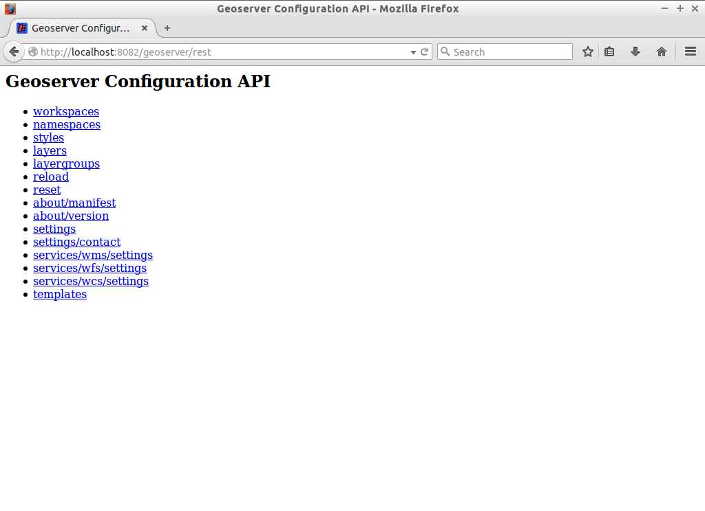

# Katalog auslesen

Wie bereits in der Einführung zu [REST](README.md) aufgeführt, ist eine zentrale Bedingung
von REST die Adressierbarkeit, d.h. jede Katalogkonfiguration im GeoServer besitzt
eine eindeutige URL. Da sich diese Konfiguration logischerweise je nach Instanz
unterscheidet, aber die Voraussetzung für die späteren Manipulations-Operationen
notwendig ist, muss es eine Möglichkeit geben, diese Ressourcen abzubilden. Das
Auslesen des existierenden Katalogs und der entsprechenden eindeutigen REST URLs
ist direkt über den Browser möglich und dabei interaktiv, d.h. navigierbar aufgebaut.

> **note**
>
> Wir werden in diesem Workshop die REST-Schnittstelle über das Kommandozeilentool
> *cURL* ansprechen. *cURL* ist ein Programm zur Client-Server Kommunikation und
> unterstützt neben vielen anderen auch das HTTP Netzwerkprotokoll. Für einfache
> Debugging-Prozesse zu empfehlen, sind für den produktiven Einsatz der REST-Schnittstelle
> Clientbibliotheken in den Programmiersprachen Java, Python, PHP und Ruby, die eine
> direkte Kommunikation aus dem Programmcode heraus erlauben, verfügbar und zu empfehlen.

## GeoServer Configuration API

Öffnen Sie ein Browserfenster und geben Sie dort die folgende Adresse ein (Die Ressource
benötigt eine Authentifizierung mit einem gültigen GeoServer Nutzer, geben Sie
hier **{{ book.geoServerUser }}:{{ book.geoServerPassword }}** ein):

<pre><code class="bash">{{ book.geoServerBaseUrl }}/rest
</code></pre>

Nach Aufruf der Adresse erscheint im Browser eine einfache Liste, die eine Übersicht
der aktuellen GeoServer Configuration API bietet (siehe Abbildung).



Die Listenansicht ist voll navigierbar und eindeutig zuordenbar. Eine Auswahl im
Browser (z.B. des Eintrags *workspaces*) navigiert den Browser zur eindeutigen
URL {{ book.geoServerBaseUrl }}/rest/workspaces. Der Aufbau der Liste (bei Auswahl eines
Arbeitsbereichs) folgt dabei der logischen Struktur des GeoServer-Katalogs:

```
workspace
  |
  +--datastore
    |
    +--featuretype
```

## GeoServer Configuration API Formate

Die obigen Aktionen im Browser rufen einen Endpunkt standardmäßig im *HTML*-Format
auf. Der GeoServer unterstützt darüberhinaus die Formate *JSON* (JavaScript Object
Notation) und *XML* (Extensible Markup Language), die insbesondere bei der
Manipulation einer Ressource relevant sind. Vergleichen Sie die folgenden
Ausgaben im Browser:

<pre><code class="bash">{{ book.geoServerBaseUrl }}/rest/workspaces
</code></pre>

<pre><code class="bash">{{ book.geoServerBaseUrl }}/rest/workspaces.json
</code></pre>

<pre><code class="bash">{{ book.geoServerBaseUrl }}/rest/workspaces.xml
</code></pre>

sowie

<pre><code class="bash">{{ book.geoServerBaseUrl }}/rest/workspaces/topp/datastores/states_shapefile/featuretypes/states
</code></pre>

<pre><code class="bash">{{ book.geoServerBaseUrl }}/rest/workspaces/topp/datastores/states_shapefile/featuretypes/states.json
</code></pre>

<pre><code class="bash">{{ book.geoServerBaseUrl }}/rest/workspaces/topp/datastores/states_shapefile/featuretypes/states.xml
</code></pre>

> **info**
> Je nach Konfiguration des Browsers erhalten Sie bei der Rückgabe eines JSON eine einzeilige Zeichnenkette.
> Um die Zeichnenkette in eine leichter lesbare Darstellung umzuwandeln, empfehlen wir die Nutzung von JSON-Formatierungswerkzeugen.
> Diese stehen in Form von Browser-Plugins (bspw. [JSON Formatter für Chrome](https://github.com/callumlocke/json-formatter) oder [JSONView für FireFox](https://jsonview.com/)) bzw. [Online Werkzeugen](https://jsonformatter.curiousconcept.com/)
> bereit.

----

Die obigen Aufrufe können ebenfalls direkt über cURL ausgeführt werden. Öffnen Sie
hierzu das Terminal (über den Button  im unteren
Systempanel) und fügen Sie dort den folgenden Befehl ein. Der aktuelle Pfad im
Terminal ist dabei irrelevant.

<pre><code class="bash">curl \
  -v \
  -u admin:geoserver \
  -XGET \
  -H "Accept: text/html" \
  {{ book.geoServerBaseUrl }}/rest/workspaces
</code></pre>

Der obige Request ist analog zu dem ersten hier aufgeführten Beispiel {{ book.geoServerBaseUrl }}/rest/workspaces
und wird entsprechend die selbe Antwort im HTML-Format liefern (siehe Output aller
vorhandenen Arbeitsbereiche im HTML-Format). Das Format der Response ist jedoch
auch über cURL steuerbar. Hierzu muss lediglich der *Accept* - Header des Requests
von *text/html* auf *application/json* bzw. *application/xml* gesetzt werden.

<pre><xmp style="margin:0; font-size: .85em;"><!DOCTYPE html PUBLIC "-//W3C//DTD XHTML 1.0 Transitional//EN" "http://www.w3.org/TR/xhtml1/DTD/xhtml1-transitional.dtd">
<html xmlns="http://www.w3.org/1999/xhtml" xml:lang="en" lang="en">
<head>
  <title>GeoServer Configuration</title>
  <meta name="ROBOTS" content="NOINDEX, NOFOLLOW"/>
</head>
<body>
Workspaces
<ul>
  <li><a href=" {{ book.geoServerBaseUrl }}/rest/workspaces/it.geosolutions.html">it.geosolutions</a></li>
  <li><a href=" {{ book.geoServerBaseUrl }}/rest/workspaces/cite.html">cite</a> [default] </li>
  <li><a href=" {{ book.geoServerBaseUrl }}/rest/workspaces/tiger.html">tiger</a></li>
  <li><a href=" {{ book.geoServerBaseUrl }}/rest/workspaces/sde.html">sde</a></li>
  <li><a href=" {{ book.geoServerBaseUrl }}/rest/workspaces/topp.html">topp</a></li>
  <li><a href=" {{ book.geoServerBaseUrl }}/rest/workspaces/sf.html">sf</a></li>
  <li><a href=" {{ book.geoServerBaseUrl }}/rest/workspaces/nurc.html">nurc</a></li>
  <li><a href=" {{ book.geoServerBaseUrl }}/rest/workspaces/cartaro.html">cartaro</a></li>
</ul>
</body>
</html>
</xmp></pre>

Nachdem wir die grundlegenden Funktionen zum Auslesen der Katalogeinstellungen
kennengelernt haben, können Sie mit dem Kapitel [Katalogeinträge erzeugen](create.md) fortfahren.
