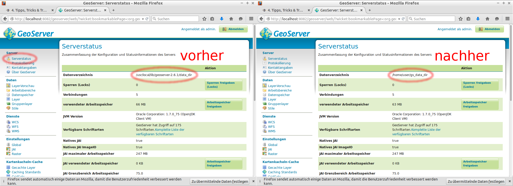

GeoServer-Datenverzeichnis auslagern
====================================

Es wird empfohlen das GeoServer-Datenverzeichnis (siehe [hier](../basics/folderstructure.md))
auszulagern. Der entscheidende Vorteil besteht darin, dass sich etwa ein GeoServer
im Produktivbetrieb auf diese Weise elegant zu einer aktuelleren Version updaten
lässt, ohne dass die Daten/Konfigurationen des GeoServers verloren gehen bzw.
separat gesichert werden müssen.

Um das Datenverzeichnis auszulagern, führen Sie die folgenden Schritte durch:

1. Wir kopieren das bestehende Datenverzeichnis aus der GeoServer-Installation
   (data\_dir/) in ein neues Verzeichnis (gs\_data\_dir/) in unserem Home-Verzeichnis,
   welches anschließend als Datenverzeichnis des GeoServers verwendet werden soll:
<pre><xmp style="margin:0; font-size: .85em;">cp -r {{ book.geoServerPhysicalPath}}data_dir/ /home/user/gs_data_dir
</xmp></pre>
2. Das Datenverzeichnis des GeoServers wird über die Umgebungsvariable (GEOSERVER\_DATA\_DIR)
  gesteuert. Bei einer klassischen WAR-Installation, etwa auf einem Tomcat, kann
  dieser Wert in der Datei (`web.xml`) gesetzt werden. Im Falle der OSGeoLive müssen
  wir diese Variable jedoch im Startup-Skript des GeoServers setzen. Führen Sie
  bitte den folgenden Befehl aus, um das Skript startup.sh mit dem Texteditor
  *leafpad* und den benötigten root-Rechten zu öffnen:
<pre><xmp style="margin:0; font-size: .85em;">sudo leafpad {{ book.geoServerPhysicalPath}}bin/startup.sh
</xmp></pre>
3. Fügen Sie an den Anfang der Datei folgende Zuweisung ein, um das in Schritt 1
   erstellte Verzeichnis als GeoServer-Datenverzeichnis zu verwenden (und
   speichern Sie anschließend die Datei):
```
GEOSERVER_DATA_DIR=/home/user/gs_data_dir
```
4. Starten Sie den GeoServer neu und beobachten Sie anschließend im Abschnitt
   *Serverstatus*, wie sich der Pfad des Datenverzeichnisses verändert hat.


> **note**
>
> Analog zur obigen Konfiguration kann auch das Verzeichnis für den GeoWebCache
> (GWC) gesteuert werden. In diesem Fall muss die Variable GEOWEBCACHE\_CACHE\_DIR gesetzt werden.

Der folgende [Abschnitt](gui.md) liefert wertvolle Hinweise zur
Problemlösung und Performanceoptimierung für den GeoServer im Produktivbetrieb.
