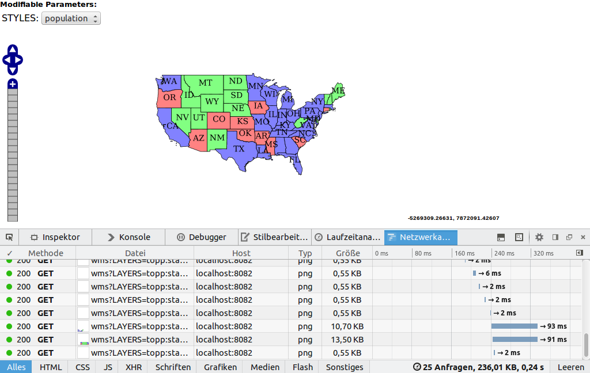
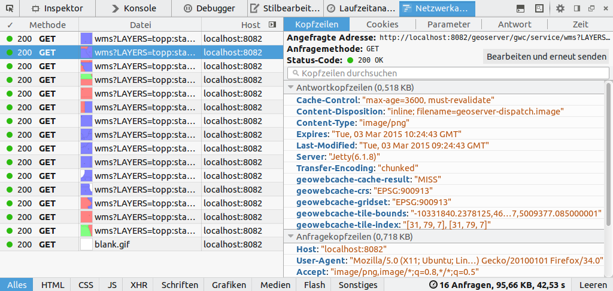
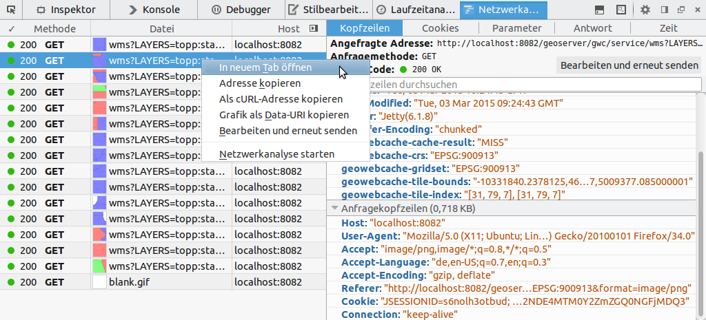

# Cachen von Layern mit GWC

Die häufigste Anforderung an einen GeoServer ist das Bereitstellen einer
OGC-konformen WMS Schnittstelle und damit das Ausgeben von Kartenmaterial im
Rasterformat. Aus diesem Grund kann das Cachen dieser Anfragen einen entschiedenen
Einfluss auf die Performance des Servers haben und sollte nach Möglichkeit auf
jedem (produktiven) System vorgenommen werden. Für das Cachen von Kartenkacheln
existieren eine Vielzahl guter OpenSource Caching-Engines, wir werden an dieser
Stelle jedoch den standardmäßig im GeoServer integrierten GeoWebCache (GWC) nutzen,
der als Proxy zwischen Client und GeoServer fungiert (siehe Abbildung).


Prinzipiell bietet der GWC zwei Methoden zum Anlegen der Kartenkacheln:

1. **On-The-Fly-Prozessierung**: Wird ein GWC-Layer erstmalig von einem Client
   angefordert, werden die entsprechenden Kartenkacheln einmalig live gerendert
   und anschließend in einem GWC-Datenverzeichnis abgelegt. Der nächste Aufruf
   des Layers im gleichen Kartenausschnitt erhält nun eine (deutlich schnellere)
   Antwort aus dem Cache.
2. **Vorrechnen von Kartenkacheln**: Die Kacheln eines Layers werden in einer
   definierten Bounding Box und in definierten Zoomstufen entlang eines Gridsets
   vorberechnet und abgelegt. Im Gegensatz zur On-The-Fly Berechnung benötigt
   diese Methode je nach verfügbarer Ressourcen eine deutliche höhere Rechenzeit,
   jedoch erhalten alle Clients eine direkte Antwort aus dem Cache, sodass die
   gefühlte Performance für den Enduser höher ist.

Wir werden im Folgenden nicht alle Konfigurationsmöglichkeiten des GWC kennenlernen
können und aus diesem Grund werden wir uns auf die grundlegende Konfiguration am
Beispiel der On-The-Fly-Prozessierung beschränken und beispielhaft einen Cache
für den Layer topp:states vorbereiten.

Auf der OSGeoLive werden die vorgerechneten Kartenkacheln im Verzeichnis
<pre>{{ book.geoServerPhysicalPath }}data_dir/gwc/</pre> abgelegt. Navigieren Sie zunächst
im Terminal  zu diesem Verzeichnis und lassen
Sie sich den Inhalt mit dem Befehl `ls -lh` (oder einer vergleichbaren Operation)
anzeigen. Die Ausgabe sollte dabei in etwa wie folgt aussehen und aktuell nur
die globale Konfigurationsdatei `geowebcache.xml` für den GWC sowie ein leeres
temporäres Verzeichnis enthalten.

```bash
-rw-rw-r-- 1 root users 4,8K Jan 14 19:58 geowebcache.xml
drwxrwxr-x 2 root users    3 Jan 14 19:58 tmp/
```

> **info**
>
> Das Verzeichnis `gwc/` wird per default auf root-Ebene im GeoServer Datenverzeichnis
> angelegt. Soll dieses geändert werden, sollte der folgende Eintrag in die web.xml
> des GeoServers eingetragen werden (Dabei unbedingt die Berechtigungen des neuen
> Ordners beachten!):
>
> ```xml
> <context-param>
>   <param-name>GEOWEBCACHE_CACHE_DIR</param-name>
>   <param-value>/dir/to/gwc_cache/</param-value>
> </context-param>
> ```

Wie wir aus dem obigen Ordnerliste entnehmen können, existiert zum aktuellen
Zeitpunkt noch kein Verzeichnis mit vorberechneten Kartenkacheln, weshalb wir im
Folgenden die notwendigen Schritte zum Anlegen eines GWC-Layers vollziehen werden:

1. Öffnen Sie in der [GeoServer GUI]({{ book.geoServerBaseUrl }}) unter  die Konfiguration
   für den Layer *"states"* und wählen Sie dort den Reiter Kartenkachel-Cache.
2. Um einen gecachten Layer zu erzeugen, muss die erste Checkbox *"Erzeuge einen
   gecachten Layer für diesen Layer"* aktiviert sein (Für den ausgewählten Layer
   bereits eingestellt).
3. Überprüfen Sie nun die weiteren Einstellungen und passen Sie diese ggf. an
   Ihre Bedürfnisse an:

    * **Metatile-Faktor**: Metatiles sind größere Kartenkacheln (Tiles), aus
      denen die zu speichernden Kacheln herausgeschnitten werden. Der Faktor gibt
      hierbei die Größe der Metatiles an, ein Faktor von 3x3 bedeutet, dass die
      Bildbreite der Zielkachel um den Faktor drei erhöht wird und sich damit für
      eine Kachelgröße von 256px eine Metatile-Kachelgröße von 768px ergibt (siehe Abbildung).

        

      Metatiles werden in erster Linie benötigt, um doppelte Kartenbeschriftungen
      (z.B. von Straßenlayern) in zwei aneinanderliegenden Kacheln zu vermeiden.
    * **Kachel-Umrandung**: Zusätzlicher Rahmen (in px), der um eine Kachel
      angefordert werden soll. Nur sinnvoll, wenn in Verbindung mit der Vernwendung
      von Metatiles Problemen bei der Darstellung von Labels und/oder Features
      am Kachelrand auftreten.
    * **Bildformat für Kacheln**: Das Standard Bildformat für die Kacheln. Dieses
      Format sollte unbedingt in Abhängigkeit Ihrer Clients bzw. des dort definierten
      Anfrage-Bildformats für die gecachten Layer gewählt werden, andernfalls
      kann der Cache nicht genutzt werden!
    * **STYLES**: Existieren für den Layer mehrere Stile, die im Client gewechselt
      werden können und somit gecacht werden sollten, müssen diese hier ausgewählt
      werden. In aller Regel wird es jedoch genügen, ausschließlich den
      Standard-Layerstil (LAYER DEFAULT) als Wert zu setzen.
    * **Verfügbare Rastergittersätze**: Das Gitternetz definiert das Netz, über
      das die gespeicherten Kacheln abgefragt werden und definiert damit den
      räumlichen Index der Einzelkacheln. Die Einzelkachel im rechteckigen Grid
      ist dabei über ein x,y,z Koordinatentripel identifizierbar (siehe Abbildung).
      Die x,y Koordinaten bestimmen die horizontale/vertikale Position, die
      z-Koordinate das Zoomlevel. Ein Grid ist dabei stets für genau ein
      Koordinatensystem gültig. Wählen Sie hier die Projektion bzw. das Grid,
      in dem der Layer gecacht werden soll.

        

    **Hinweis**: Die Standardeinstellungen für einen neuen gecachten Layer können Sie
    unter dem Menüeintrag |gui2| anpassen.

4. Im nächsten Schritt werden wir prüfen, ob der Layer korrekt gecacht wird. Hierzu analysieren wir
   die HTTP-Response-Headers eines GWC-Layers bspw. der einer der gelieferten Kacheln.
   Öffnen Sie hierzu die GWC Layervorschau und wählen Sie dort unter dem Layereintrag `topp:states`
   in der Combobox Vorschau den Wert EPSG:900913/png. Nachdem die Vorschau in einem
   neuen Tab/Fenster geöffnet wurde, öffnen wir über `F12` die Entwicklerkonsole
   des Browsers und navigieren in dieser zum Reiter Netzwerkanalyse (siehe Abbildung).
    **Wichtig:** Nach Aktivieren der Konsole bzw. der Netzwerkanalyse muss die
    aktuelle Seite ggf. neu geladen werden!

    

5. Leeren Sie die Netzwerk-Übersicht ( unten rechts in der
   Entwicklerkonsole) und zoomen Sie (einmalig!) zu einem beliebigen Kartenausschnitt.
6. Im Reiter Netzwerkanalyse erscheinen alle Requests des Kartenclients an den
   GeoServer. Wählen Sie aus dieser Liste einen beliebigen WMS-Request aus und
   öffnen Sie im rechten Bereich den Reiter Kopfzeilen (siehe Abbildung):

    

    Die Ansicht zeigt neben den Anfragekopfzeilen des Clients auch die
    Antwortkopfzeilen des Servers. Für uns sind die Folgenden Headerinformationen
    von Relevanz:

    * `geowebcache-cache-result`: Wurde die Kachel aus dem Cache ausgeliefert, wird
      der Wert HIT, andernfalls MISS ausgegeben. Das obige Beispiel sollte MISS
      ausgeben, da zum aktuellen Zeitpunkt kein Cache vorhanden ist.
    * `geowebcache-crs`: Das Koordinatensystem der Kachel.
    * `geowebcache-gridset`: Der Name des zu Grunde liegenden Gridsets.
    * `geowebcache-tile-bounds`: Die BoundingBox der Kachel.
    * `geowebcache-tile-index`: Der Index der Kachel (X,Y,Z) im Gridset.

7. Nachdem die obige Beispiel-Kachel erstmalig angefordert wurde, wird der GWC
   diese Kachel im Cache ablegen und künftige Requests werden die Antwort aus
   selbigem erhalten. Um dies zu überprüfen werden wir nun die o.g. Kachel neu
   laden, indem wir in der Entwicklerkonsole das Kontextmenü aufrufen und In
   neuem Tab öffnen auswählen (siehe Abbildung).

    

8. Öffnen Sie in dem neuen Fenster/Tab erneut die Entwicklerkonsole über `F12`
   und aktivieren Sie den Reiter Netzwerkanalyse. Betrachten Sie nun den
   Response-Header `geowebcache-cache-result`. Was fällt Ihnen auf?
9. Navigieren Sie abschließend - falls nicht mehr geöffnet - im Terminal zum
   GWC-Verzeichnis (`{{ book.geoServerPhysicalPath}}data_dir/gwc/`) und prüfen
   Sie dort den (neuen) Ordner `topp_states`, in dem der GWC die Kacheln aus selbigem
   Layer abgelegt hat. Die obige Kachel lässt sich dabei anhand der
   Header-Informationen `geowebcache-gridset` und `geowebcache-tile-index`
   eindeutig identifizieren:

    ```
    topp_states/ (Layername)
      |
      +-- EPSG_900913_07/ (Gridset + Zoomstufe)
            |
            +-- 01_04/ (inter berechnete Notation auf Basis von Gridset + Zoomstufe)
                  |
                  +-- 0031_0079.png (Kachelindex)
    ```

Sie haben in diesem Kapitel erfolgreich die Basiskonfiguration für einen GWC-Layer
vorgenommen und Methoden kennengelernt, selbige Layer über die Entwicklerkonsole
im Browser zu analysieren. Fahren Sie nun mit dem [nächsten Kapitel](datadir.md)
(Datenverzeichnis auslagern) fort.

**Zusatzinformation: Vorrechnen der Kartenkacheln**

In der Praxis wird es in aller Regel unter gegebenen Ressourcen notwendig sein,
den Layercache für häufig angeforderte Layer im Voraus zu berechnen. Die folgende
Liste führt die notwendingen Schritte am Beispiel des Layers topp:states in
Kurzform auf. Weiterführende Informationen finden Sie in der [GWC Dokumentation](http://geowebcache.org/docs/stable/webinterface/index.html).

1. Öffnen Sie die die GWC Administrationsoberfläche über {{ book.geoServerBaseUrl }}/gwc
   und wählen Sie unter A list of all the layers and automatic demos den Eintrag
   Seed this Layer unterhalb von Layer topp:states aus. In diesem Dialog kann
   über die oberen beiden Auswahlboxen geprüft werden, ob für den aktuell
   ausgewählten Layer bereits ein Task läuft oder geplant ist. Falls gewünscht,
   kann dieser abgebrochen werden.
2. Um einen neuen Task zu starten, sind folgende Einstellungen notwendig:

* **Number of tasks to use:** Anzahl der Threads für diesen Seed. Um den
  Server (und damit die Reaktionsgeschwindigkeit des GeoServers) in einer
  produktiven Umgebung nicht zu sehr mit dem Rechenvorgang zu belasten, sollte
  hier der minimale Wert (01) gewählt werden. Ist der GeoServer (noch) nicht
  produktiv kann ein höherer Wert gewählt werden.
* **Type of operation:** Auswahl der Seed-Operation. Reseed generiert alle Kacheln
  neu, Seed nur die fehlenden und Truncate löscht alle existierenden Kacheln.
  Für die obigen Layer empfiehlt sich die Operation Reseed.
* **Grid Set:** Auswahl des Projektionssystems bzw. des Gridsets.
* **Format:** Auswahl des Bildformats.
* **Zoom start:** Auswahl der kleinsten Zoomstufe (kleiner Maßstab).
* **Zoom stop:** Auswahl der höchsten Zoomstufe (großer Maßstab). Eine höhere
  Zahl repräsentiert eine detailliertere Kartenansicht. Je höher der Wert, desto
  höher auch der Rechenaufwand und der belegte Speicher!
* **Bounding box:** Optionaler Parameter zur Angabe des BoundingBox. Falls keine
  Werte angegeben werden, werden die Angaben des Layers selbst genutzt. Diese
  sollten in aller Regel korrekt sein, sodass hier keine Angabe erforderlich ist.
  Ausnahme: Nur ein begrenztes Gebiet soll gecacht werden.

3. Nachdem alle Einstellungen vorgenommen wurden, wird der (Re-)Seed über den
Button "Submit" gestartet.

> **note**
>
> Die obigen Schritte zum Anlegen eines Layercache sind auch über eine REST-API möglich. Informationen und gute Beispiele zu dieser API finden Sie unter [<http://docs.geoserver.org/stable/en/user/geowebcache/rest/index.html>](http://docs.geoserver.org/stable/en/user/geowebcache/rest/index.html)
