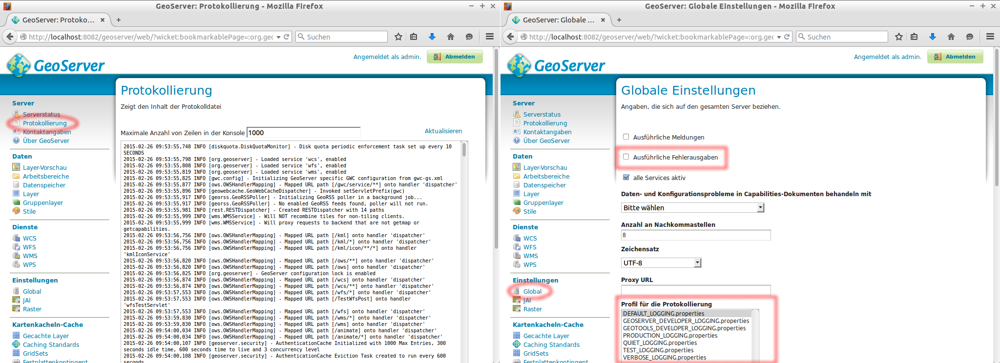
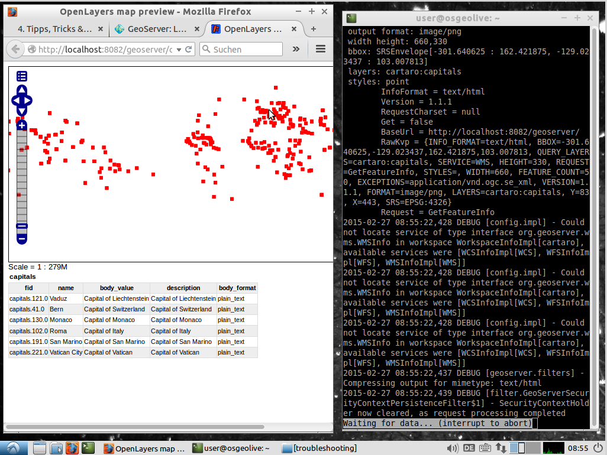

# Protokollierung

Bei jeglichen Fehlern, die sich auf den GeoServer zurückführen lassen (wie z.B.
keine oder falsche Antwort eines Kartendienstes) ist das Protokoll die erste
Anlaufstelle. Das GeoServer Protokoll lässt sich dabei entweder direkt über
die GUI oder aus dem Dateisystem (<code>/usr/local/lib/geoserver-{{ book.geoServerVersion }}/data_dir/logs/geoserver.log</code>) aufrufen.
Bei schwerwiegenden Problemen bzw. Fehlern steht der Logging-Message das Kürzel `ERROR` vor,
rein informativen Protokollmeldungen das Kürzel `INFO`.

Für die Protokollierung des GeoServers lassen sich verschiedene Profile einstellen.
Diese unterscheiden sich in der Sensitivität, in der die Prozesse des GeoServers
protokolliert werden. Das zu verwendende Protokoll kann über die GeoServer-Weboberfläche
im Bereich Einstellungen -\> Global konfiguriert werden. Der Wechsel eines Profils
wirkt sich sofort aus, d.h. der GeoServer muss *nicht* neu gestartet werden!

Ist die Checkbox bei *Ausführliche Fehlerausgaben* gesetzt, wird der volle
Java-Stacktrace in die Log-Datei geschrieben. Da hierdurch größere Log-Dateien
verursacht werden, ist diese Einstellung nur für das Debuggen zu empfehlen.

Hier eine kurze Erläuterung einiger Protokoll-Profile:

| Profil | Beschreibung |
| --------- | ----------- |
| `DEFAULT_LOGGING` | Mittleres Protokolllevel auf fast allen Modulebenen des GeoServers.|
| `GEOSERVER_DEVELOPER_LOGGING` | Ausführliche Protokollierung auf Ebene des Moduls GeoServer. Nur sinnvoll, wenn der GeoServer debuggt wird.|
| `GEOTOOLS_DEVELOPER_LOGGING` | Ausführliche Protokollierung auf Ebene des Moduls Geo-Tools. Diese Auswahl kann nützlich sein, wenn überprüft werden soll, welche SQL Statements (z.B. bei einer GetFeature-Abfrage) an die Datenbank gesendet werden.|
| `PRODUCTION_LOGGING` | Minimale Protokollierung, nur Fehler werden ausgegeben. Diese Einstellung ist für den *Produktiveinsatz* zu wählen.|
| `VERBOSE_LOGGING` | Ausführliche Protokollierung auf allen Ebenen des GeoServes. Nur sinnvoll, wenn der GeoServer debuggt wird.|

Wir wollen das Protokoll des GeoServers nun *live* über das Dateisystem beobachten.
Dazu führen müssen die folgenden Schritte ausgeführt werden.

1. Stellen Sie das VERBOSE\_LOGGING-Profil ein.
2. Der GeoServer auf der OSGeoLive ist so konfiguriert, dass nicht automatisch
   in die Protokolldatei, sondern in die Standardausgabe des Java-Prozesses
   geschrieben wird. Wir müssen also den **Haken bei**
   *in die Standardausgabe schreiben* **entfernen**, sodass das Protokoll in die
   Datei <code>/usr/local/lib/geoserver-{{ book.geoServerVersion }}/data_dir/logs/geoserver.log</code> geschrieben wird.
3. Speichern Sie die Einstellungen (unten).
4. Öffnen Sie die Konsole und führen Sie den folgenden Befehl aus:

<pre><code>less +F /usr/local/lib/geoserver-{{ book.geoServerVersion }}/data_dir/logs/geoserver.log</code></pre>

> **note**
>
> Normalerweise würde man statt less +F den Befehl tail -f verwenden. Dies
> funktioniert auf der OSGeoLive aber aus unbekannten Gründen nicht. Die
> *Live*-Beobachtung der Datei kann durch das Drücken der Tastenkombination
> STRG + C beendet werden.

1.  Öffnen Sie eine Layer-Vorschau und beobachten Sie wie sich das Protokoll verändert.

Die folgende Abbildung stellt diese Schritte dar:

Sie können nun *live* beobachten wie sich der Inhalt der Logdatei verändert. Dabei
sehen Sie immer das Ende der Protokolldatei. Jede Interaktion in der Vorschau des
Layers (z.B. Zoomen oder Klicken) kann nun im Protokoll nachvollzogen werden. Sie
können das Protokollprofil auch ändern, um zu beobachten wie sich die Sensitivität
der Ausgabe verändert.

Das GeoServer-Logging-System basiert auf der Java-Logging-Bibliothek Log4J.
Somit gibt es zusätzlich die Möglichkeit eigene LOGGING-Profile zu definieren und diese im Geoserver-Datenverzeichnis im Unterordner `logs/` bereitzustellen.
Näheres hierzu finden Sie [hier](http://docs.geoserver.org/maintain/en/user/advanced/logging.html).

Im folgenden [Abschnitt](gwc.md) geht es mit dem Thema *GeoWebCache (GWC)* weiter.
